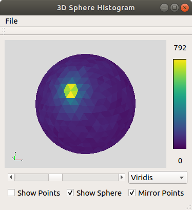

# Sphere Histogram
## Brief description
`sphere-histo` is a graphical tool to depict a distribution of points in 3D space on a sphere approximated by congruent triangles. The triangles' colors indicate the density of points lying in the respective direction.
Points can be read from .npy files with shape (n, 3).

## Dependencies
- Qt 5 (https://www.qt.io/download-open-source)
- OpenGL (https://www.opengl.org)
- zlib (https://zlib.net/)
- GLM (https://glm.g-truc.net/0.9.9/index.html)

For building:
- CMake (>= v.3.5)
- make
- g++

## How to deploy 
(Incl. example commands for Debian/Ubuntu based Linux distributions)

0. Make sure to have the __dependencies__ installed on your system  
 (Package names for Debian/Ubuntu: `qt5-default libgl1-mesa-dev zlib1g-dev libglm-dev`) 

1. Clone this Git repository  
`$ git clone https://jugit.fz-juelich.de/a.roethenbacher/sphere-histo.git`

2. Change into the project's source directory  
`$ cd sphere-histo/sphere-histo`

3. Create a build directory and change into it  
`$ mkdir build`

4. Change into build directory  
`$ cd build`

5. Use CMake to generate Makefile  
`$ cmake ..`

6. Use make to install  
`$ make`

7. Start application from the same directory  
`$ ./sphere-histo [optional: filepath of .npy file]`

## How to use

- Inside the application window click File->Open to open a .npy file
- Use the selection box next to the slider to choose your preferred color map
- Use the slider below the sphere to change the number of triangles, that approximate the sphere

- The value above the colorbar indicates the maximum number of points "inside" a single triangle with the current settings in place
- To turn the sphere, press the left mouse button while moving the mouse
- To move the sphere, press the right mouse button while moving the mouse
- Use the mouse wheel to zoom

- Use the checkboxes to display sphere points or both
- Use the checkbox "Mirror Points" to select wether the opened points should be mirrored with reference to (0,0,0)

## License
This project is licensed under the MIT License (s. LICENSE file).

## Acknowledgements

This project uses the following third-party open source libraries with great appreciation:
- cnpy
- GLM
- Qt 5
- zlib

Special gratitude is given to __matplotlib__ (https://matplotlib.org/index.html) for freely distributing their wonderful colormaps and the __Khronos(c) Group__ (https://www.khronos.org/) for sharing and maintaining the Free __OpenGL API__ (https://www.opengl.org//).

The used libraries are released under the following license conditions:

### cnpy
MIT License (https://github.com/rogersce/cnpy/blob/master/LICENSE)

### GLM
MIT License (https://glm.g-truc.net/copying.txt)

### QT 5
GNU General Public License v3 (https://www.gnu.org/licenses/gpl-3.0.en.html)

### zlib
zlib.h -- interface of the 'zlib' general purpose compression library
  version 1.2.11, January 15th, 2017

  Copyright (C) 1995-2017 Jean-loup Gailly and Mark Adler

  This software is provided 'as-is', without any express or implied
  warranty.  In no event will the authors be held liable for any damages
  arising from the use of this software.

  Permission is granted to anyone to use this software for any purpose,
  including commercial applications, and to alter it and redistribute it
  freely, subject to the following restrictions:

  1. The origin of this software must not be misrepresented; you must not
     claim that you wrote the original software. If you use this software
     in a product, an acknowledgment in the product documentation would be
     appreciated but is not required.
  2. Altered source versions must be plainly marked as such, and must not be
     misrepresented as being the original software.
  3. This notice may not be removed or altered from any source distribution.

  Jean-loup Gailly        Mark Adler
  jloup@gzip.org          madler@alumni.caltech.edu

