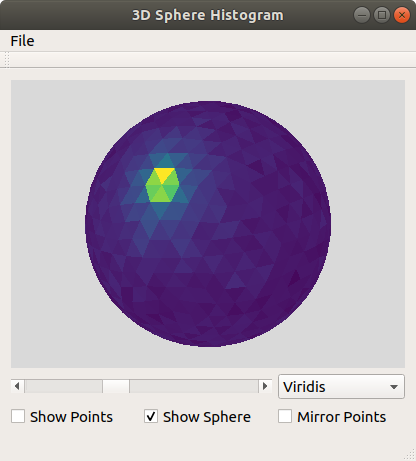
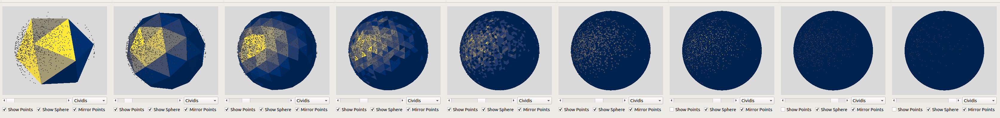
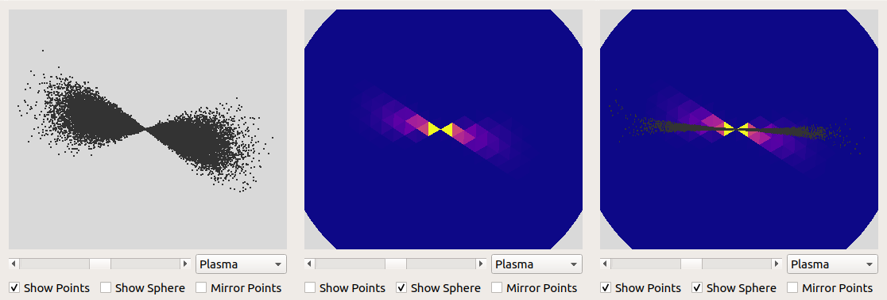

# Sphere Histogram
## Brief description
`sphere-histo` is a graphical tool to depict a distribution of points in 3D space on a sphere approximated by congruent triangles. The triangles' colors indicate the density of points lying in the respective direction.
Points can be read from .npy files with shape (n, 3).

## Dependencies
- qt5-default
- libgl1-mesa-dev
- zlib1g-dev
- libglm-dev

For building:
- CMake (>= v.3.5)
- make
- g++

## How to deploy
0. Make sure to have the __dependencies__ installed on your system

1. Clone this Git repository  
`$ git clone https://jugit.fz-juelich.de/a.roethenbacher/sphere-histo.git`

2. Change into the project's source directory  
`$ cd sphere-histo/sphere-histo`

3. Create a build directory and change into it  
`$ mkdir build`

4. Change into build directory  
`$ cd build`

5. Use CMake to generate Makefile  
`$ cmake ..`

6. Use make to install  
`$ make`

7. Start application from the same directory  
`$ ./sphere-histo [optional: filepath of .npy file]`

## How to use

- Inside the application window click File->Open to open a .npy file
- Use the selection box next to the slider to choose your preferred color map
- Use the slider below the sphere to change the number of triangles, that approximate the sphere

- To turn the sphere, press the left mouse button while moving the mouse
- To move the sphere, press the right mouse button while moving the mouse
- Use the mouse wheel to zoom

- Use the checkboxes to display sphere points or both
- Use the checkbox "Mirror Points" to select wether the opened points should be mirrored with reference to (0,0,0)

